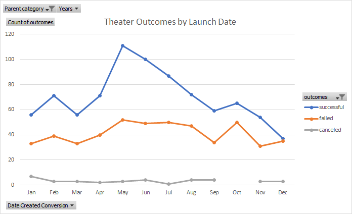
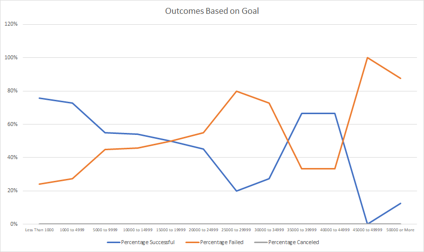

# kickstarter-analysis

## Overview of Project
Perform data analysis on several thousand crowdfunding projects to be able to visualize campaign outcomes based on their launch dates and their funding goals to understand and present the data and help Louise determining the fundraising goal and launch date for the play *Fever*. We believe that, by bringing the data into readable charts, Louise will be able to understand the previous fundraisings successful campaigns and use this information to determine details for her project.

## Analysis and Challenges

### Theater Outcomes vs Launch
The chart below presents Theater campaigns outcomes according to the month the projects were launched.
This chart was prepared in from a pivotable from the Kickstarter data in the Excel, using filter for the parent category "theater". The rows were determined by the launch month of the projects to count the number of successful, failed, or canceled campaigns according to the month the campaigns were launched. There was no challenge to perform this task, however, difficulty may be encountered to understand the order the pivotable must be organized to bring the right information requested.
###### Analysis:
The month that launched the most successful theater campaigns was May. The number of successful projects started increasing in April, then in June the success of the projects started slowly declining.
May, June, July and August had roughly the same number of failed campaigns launched, decreasing it in September, and the month that launched the most failed theater campaigns was October.

### Plays Outcomes vs Goals
The chart below presents Play campaigns outcomes percentages according to the goal amount of the projects.
This chart was prepared in the Excel from a list that applying COUNTIF formula brought the number of successful, failed and cancelled projects according to the dollar range of previous campaigns. It was challenging to create a COUNTIF formula with so many criteria and I had to watch tutorial videos to understand exactly for the formula works.
###### Analysis:
Projects with goal up to $10K had the most successful campaigns. The chart also presents an increase of successful campaigns between the goal range of $35-45K.
Projects with goals over $15K had more failed than succeeded campaigns, except for the range of $35-45k mentioned before. Projects over $45K had the most failed campaigns.

## Results
### Theater Outcomes by Launch Date
According to the chart, the spring and summer shows the most successful campaigns launched in this period, therefore, from April to August are good months to launch a campaign. May seems the best month to launch a campaign, since it was the month that launched the most successful theater campaigns. The fall and winter present the months with most failed projects, specially December that is the only month that shows the number of failed is equal to successful campaigns, while any other month the number of successful exceeded the failed campaigns.

### Plays Outcomes vs Goals
According to the chart, campaigns with goals up to $10k had more success than failure cases, therefore, campaigns with fundraising goal up to $10K are more likely to succeed. There is an increase in the number of succeeded campaigns for the 35-45k campaigns, however, we would need to work more on those data to confirm this information. 

### Limitations and Recommendations
These charts provide limited information, since it does not shows information according to the country Louise would like to launch the play and the number of backers.
The pivotable prepared for the Theater Outcomes by Launch Date analysis, should contain a filter "country", and the list of the Plays Outcomes vs Goals analysis should contain one more criteria to bring only outcomes from the country "US", therefore, the charts would give was a better understand of the region Louise intends to launch the project.
Also, it would be important for Louise to understand how many backers she should expect to be able to meet her goal, in order to do that, we should create a list similar to the one we created for the Plays Outcomes vs Goals analysis, however, instead of the goal amount ranges, we should list the number of backers range, and the COUNTIF formulas should contain the criteria: outcome "Successful", goal amount ">=3000<=5000", county "US", subcategory "plays" and the range of bakers according to the list, therefore, Louise would be able to understand how many backers she should seek to be able to succeed.
